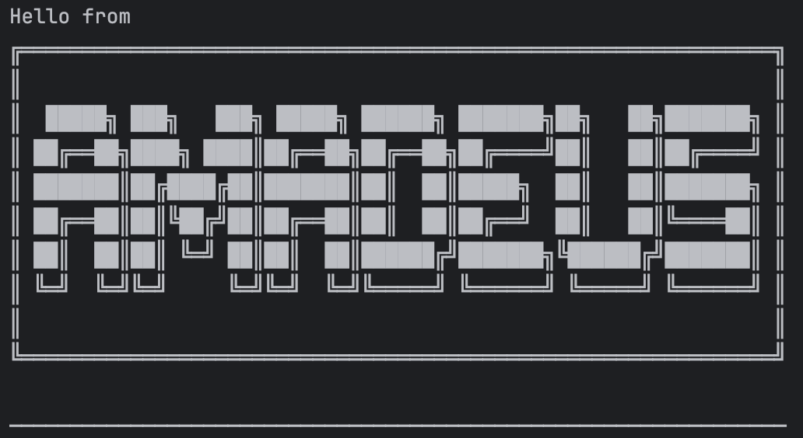

# Amadeus Chatbot User Guide  
  
  
  
Welcome to **Amadeus**, your friendly command-line task manager chatbot!    
Amadeus helps you manage your todos, deadlines, and events, all through a simple text interface.    
It also has fun modes like Echo and D-mail to experiment with messages.  
  
---  
  
## Getting Started  
  
1. Run the program:  
java -jar ip.jar  
2. Amadeus will greet you and show the available modes:  
- Echo  
- D-mail  
- List  
  
3. Type the name of the mode you want to use and press Enter.  
  
---  
  
## Features  
  
### 1. Echo Mode  
Echo mode repeats whatever you type until you type `Esc`.    
  
**Usage:**    
Echo    
  
**Example:**    
Hello    
You just said: Hello    
Esc    
System shutting down...    
  
---  
  
### 2. D-mail Mode  
D-mail mode sends messages to the past (in the program's story!). Exit with `El Psy Kongroo`.  
(It is the same as the echo mode with some personalisation)  
**Usage:**    
D-mail    
**Example:**    
Hello past!    
📧 Message received in world line 1.130205%: Hello past!    

El Psy Kongroo    
System shutting down...    
  
---  
  
### 3. List Mode  
List mode lets you manage your tasks: add, mark, unmark, delete, and find.  
  
**Usage:**    
List    
    
---    
  
### 4. Add a Todo    
Add a simple task to your list.  
  
**Usage:**  
todo <description>  
**Example:**  
todo read book  
  
---  
  
### 5. Add a Deadline  
Add a task with a due date.  
  
**Usage:**  
deadline <description> /by <yyyy-MM-dd HHmm>  
**Example:**  
deadline submit report /by 2025-10-05 2359  

---

### 6. Add an Event  
Add a task with a start and end time.  
  
**Usage:**  
event <description> /from <yyyy-MM-dd HHmm> /to <yyyy-MM-dd HHmm>  
**Example:**  
event project meeting /from 2025-10-05 1400 /to 2025-10-05 1600  
  
---  
  
### 7. List All Tasks  
See all your current tasks.  
   
**Usage:**  
list  
**Example Output:**  
1.[T][ ] read book  
2.[D][ ] submit report (by: Oct 5 2025 23:59)  
  
---  
  
### 8. Mark a Task as Done  
Mark a task as completed.  

**Usage:**  
mark <task number>  
**Example:**  
mark 2  
  
---  
  
### 9. Unmark a Task  
Mark a task as not done.  
  
**Usage:**  
unmark <task number>  
**Example:**  
unmark 2  
  
---  
  
### 10. Delete a Task  
Remove a task from your list.  
  
**Usage:**  
delete <task number>  
**Example:**  
delete 1  
  
---  
  
### 11. Find Tasks by Keyword  
Search for tasks containing a specific word.  
  
**Usage:**  
find <keyword>  
**Example:**  
find report  
  
---  
  
### 12. Exit Amadeus  
Say goodbye to Amadeus and close the program.  
  
**Usage:**  
Disconnect  
**Example Output:**  
System shutting down... awaiting next transmission.  
El Psy Kongroo.  
  
---  
  
## Notes  
  
- Dates and times must be entered in the format `yyyy-MM-dd HHmm`.    
- Task numbers refer to the number shown in the `list` command.    
- Your tasks are automatically saved between sessions in the file path given at startup (default: `./data/amadeus.txt`).    
- Always type commands exactly as shown (case-insensitive for commands like `mark`, `unmark`, `todo`, etc.).    
- Modes Echo and D-mail are fun experimentation modes but you can always return to List mode to manage tasks.  
  
---  
  
Enjoy using **Amadeus** to organize your tasks and explore time-message fun!  
